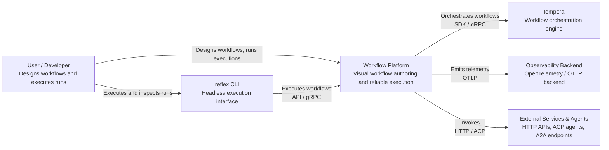
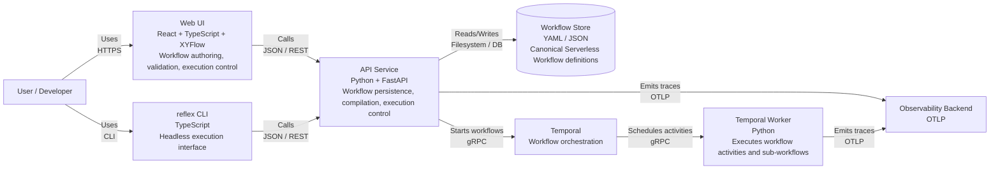
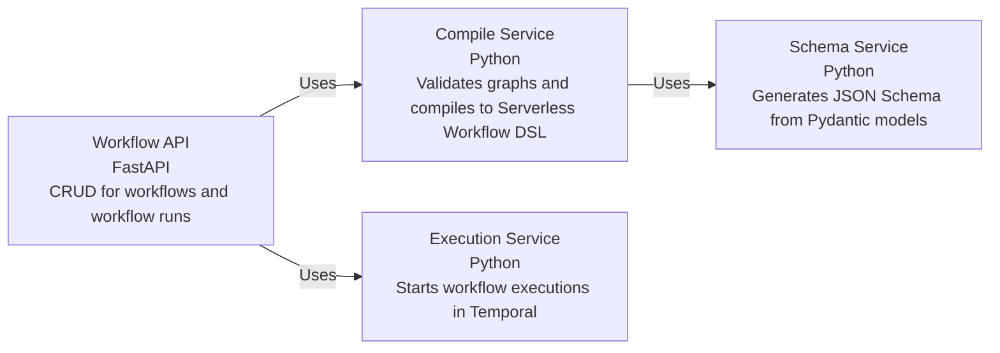
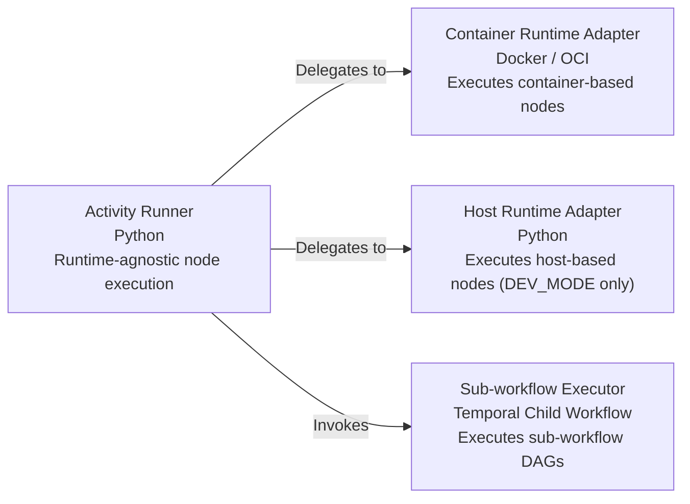

# Workflow Platform — Final Tech Stack, Architectural Rules, Rollout Plan, Test Strategy & Risk Analysis

This document defines the **complete, authoritative system design** for the workflow platform, including:

- Final tech stack
- Architectural rules
- Distribution model
- Built-in node taxonomy
- **Test strategy**
- Adversarial risk analysis and mitigations
- MVP definition and rollout plan

It is intended to be **downloadable, durable, and execution-ready**.

---

## 1. Vision & Primary Goal

> **Build a reliable, observable, distributed workflow platform with a first-class UI,  
> while writing mostly glue code and leveraging best-in-class systems.**

Core principles:
- Correctness before cleverness
- Container-first, but not container-only
- Explicit contracts everywhere
- No proprietary DSL lock-in
- Distribution without redesign
- UX clarity over feature density

---

## 2. Execution Philosophy — Container-First (Not Container-Only)

- The **entire platform** (UI, API, workers, Temporal) runs in containers by default
- **Node execution** supports two runtimes:
  - **Container runtime** (default, production-safe)
  - **Host runtime** (explicit opt-in, local/dev only)

Design intent:
- Containers → reproducibility, safety, scalability
- Host execution → fast iteration, notebooks, local ergonomics

---

## 3. Frontend — Workflow Authoring & UX

### Core
- React + TypeScript
- **[XYFlow](https://xyflow.com/) (`@xyflow/react`)**
  - DAG editor
  - Custom nodes and handles
  - Two edge types: **control flow** vs **data flow**

### Layout
- [ELK](https://www.eclipse.org/elk/) (Eclipse Layout Kernel via `elkjs`)
  - Port-aware layout
  - Edge-crossing minimization
  - Deterministic re-layout

### Forms & Editors
- JSON Schema (generated from backend)
- React JSON Schema Form (RJSF) or JSON Forms
- Monaco Editor for:
  - Serverless Workflow YAML
  - Templates
  - Python / JS / TS scripts

### Execution UX
- Per-node runtime selector: `container` | `host`
- Runtime badges and warnings
- Inline logs and node-level status

### Telemetry
- [OpenTelemetry JS](https://opentelemetry.io/docs/languages/js/)
- Trace propagation on workflow execution

### CLI

Workflow execution and control is exposed via a headless CLI that acts as the another execution interface 
in addition to the web frontend.
`reflex` can be invoked by humans, automation, or higher-level systems and provides a stable contract for
starting, inspecting, replaying, and compensating workflow runs.

```
reflex # Opens the main TUI
reflex run <workflow>
reflex plan <workflow>
reflex validate <workflow>
reflex trace <run-id>
reflex replay <run-id>
reflex compensate <run-id>
reflex stop <run-id>
```

- TypeScript-based headless CLI for execution control with **[OpenTUI](https://github.com/anomalyco/opentui) (`@opentui/core`)**
- Long-term plan: a marvellous TUI layered on the same core
- Provides a stable contract for running, inspecting, and compensating workflows

### Architecture Diagrams (Mermaid)

#### System Context Diagram



#### Container Diagram



#### API Service Component Diagram



#### Temporal Worker Component Diagram



---

## 4. Canonical Workflow Definition & Persistence

- **[Serverless Workflow Specification](https://serverlessworkflow.io/)**
  - YAML / JSON
  - Stored verbatim as canonical truth
- UI metadata stored separately:
  - node positions
  - grouping / collapse state
  - viewport

**Rule:**  
> The UI graph is a projection. The DSL is canonical.

Execution runtime and distribution hints are **metadata**, not workflow semantics.

---

## 5. Backend — Core Platform (Python)

### Domain Modeling
- **[Pydantic v2](https://docs.pydantic.dev/)** everywhere at boundaries

Pydantic models define:
- Node parameters
- Node input/output contracts
- Template context
- Execution context
- Activity envelopes
- Runtime specifications
- Sub-workflow contracts

JSON Schema is always **derived**, never hand-written.

---

## 6. Compiler Layer (Primary Glue)

Responsibilities:
- XYFlow graph → IR
- IR → Serverless Workflow DSL
- Control edges → transitions
- Data edges → typed bindings
- Runtime resolution (container | host)
- Distribution target resolution (task queues)
- Sub-workflow validation
- Static template validation

Design constraints:
- Minimal IR
- No optimization passes
- Deterministic output
- Golden-file tests

---

## 7. Workflow Execution Engine

- **[Temporal](https://docs.temporal.io/) (Python SDK)**

Execution model:
- One workflow per DAG run
- Deterministic orchestration only
- No I/O, randomness, or time access
- All work done in activities or child workflows

### Transaction Semantics — Saga Pattern

Workflow execution follows the **Saga pattern**.

- Each node represents a **forward action**
- Nodes may optionally define a **compensation action**
- Compensation actions are executed in reverse order upon failure
- Compensation is explicit, not implicit

There is no global transaction and no automatic rollback.
Failure handling is modeled as business logic, not infrastructure behavior.

Controllers:
- foreach / map / retry / condition
- Single-node representation in the DAG
- Runtime expansion via:
  - child workflows
  - continue-as-new

---

## 8. Sub-Workflows (Composition)

> **A sub-workflow is a node that invokes another workflow definition.**

- Single node in parent DAG
- Explicit input/output contracts
- Implemented as Temporal child workflows
- No shared mutable state
- Independent retries and telemetry

---

## 9. Activity Runtime — Hybrid

### Runtimes

**Container runtime (default)**
- Docker / OCI
- Production-safe
- Isolated

**Host runtime (opt-in)**
- Local / trusted machines only
- Dev-focused
- Explicit warnings and validation

All nodes compile to a **runtime-agnostic execution spec**:
- Inputs / outputs
- Artifacts
- Logs
- Telemetry
- Task queue

---

## 10. Built-in Node Types

### Execution & IO
- Papermill
- Bash
- HTTP

### Data Transformation
- Python Script (structured transformations)
- JavaScript / TypeScript Script (JSON reshaping)

### Agent & Interaction
- Agent ACP (Agent Client Protocol)
- A2A calls (agent-to-agent / service-to-service)

All nodes:
- Follow the same Node Protocol
- Are pure with respect to orchestration
- Use typed contracts

---

## 11. Templates & Expressions

- Jinja (sandboxed)

Rules:
- StrictUndefined
- No control flow
- No side effects
- No orchestration influence

Templates interpolate values only.

---

## 12. Observability & Telemetry

- [OpenTelemetry](https://opentelemetry.io/docs/) end-to-end
- One trace per workflow run
- One span per node
- Consistent attributes (workflow ID, run ID, node ID, runtime)

Optional:
- Langfuse via OTLP for agent/LLM observability

---

## 13. Distribution & Scaling

### Core Rule
> Distribution is handled **only** by Temporal task queues.

- DAGs are distribution-agnostic
- Nodes do not encode placement logic

Each node specifies:
- Runtime
- Task queue

Workers differ only by:
- capabilities
- task queues they listen to

---

## 14. Test Strategy (Effective, Minimal, Non-Overengineered)

### 14.1 Testing Philosophy

> **Test the boundaries, not the libraries.**  
> Most defects will be contract mismatches, invalid graphs, incorrect compilation, or broken execution semantics.

This strategy prioritizes:
- Determinism
- Fast feedback
- High signal-to-noise
- A small number of end-to-end proofs

**Do not** attempt to test Docker, Temporal internals, Jinja internals, ELK internals, or OpenTelemetry exporters.

---

### 14.2 Test Pyramid (Target Shape)

```
                [ Few E2E ]
          [ Minimal Temporal ]
       [ Node Execution Smoke ]
   [ Compiler + Template Validation ]
[ Pydantic Contracts + Schemas ]
```

---

### 14.3 Layer 1 — Pydantic Contract & Schema Tests (Highest ROI)

Scope:
- Node parameter models
- Node IO contract models
- Sub-workflow IO contracts
- Activity input/output envelopes
- Execution spec models

Must test:
- Valid cases parse successfully
- Invalid cases fail with clear errors
- JSON Schema generation is stable (no breaking field name drift)
- Backward compatibility for versioned models (when introduced)

Tools:
- `pytest`
- pure Pydantic validation (no mocks)

---

### 14.4 Layer 2 — Compiler Golden Tests (Critical)

Scope:
- Graph/IR → Serverless Workflow DSL
- Runtime resolution and task queue targeting
- Sub-workflow references
- Data binding generation
- Validation failures (negative tests)

Strategy:
- Maintain a small fixture set of graphs (JSON)
- Compile to DSL
- Compare against expected DSL outputs (golden/snapshot files)
- Ensure deterministic output ordering (sorted states/actions where needed)

Benefits:
- Catches semantic regressions early
- Protects you when extending node types or bindings

---

### 14.5 Layer 3 — Template Validation Tests

Scope:
- Jinja template rendering in sandboxed environment
- Static validation rules

Must test:
- StrictUndefined behavior
- Rejection of forbidden constructs (control flow, macros)
- Deterministic render given context
- Good error location reporting for user feedback

No activity execution involved.

---

### 14.6 Layer 4 — Node Execution Smoke Tests

Goal:
- Prove the Node Protocol is executable in both runtimes (where supported)
- Not to validate user code correctness

Strategy:
- One smoke test per node type
- Minimal inputs and simple expected outputs
- Prefer host execution for speed (dev-only) and container tests for realism

Include:
- Python Script node (host + container)
- Bash node (container)
- HTTP node (container or host)
- Papermill (one minimal notebook)
- Agent ACP (mock endpoint or local stub)

Enforce:
- timeout behavior
- structured outputs
- log capture
- artifact capture (even if to temp directory)

---

### 14.7 Layer 5 — Minimal Temporal Workflow Tests

Scope:
- One happy-path DAG
- One failure-path DAG (activity fails)
- One sub-workflow DAG (child workflow)
- One controller case (foreach) once controllers are included

Strategy:
- Use Temporal test environment
- Stub most activities for speed
- Keep 1–2 “real activities” tests for confidence

Validate:
- orchestration semantics
- retries/failure propagation
- child workflow result propagation
- history does not explode for small cases

---

### 14.8 Layer 6 — End-to-End (Very Few, Very Valuable)

Run only in CI/nightly:
- Bring up full stack via containers
- Execute 1–3 representative workflows:
  1) data binding + python transform
  2) sub-workflow call
  3) distributed queues across two workers

Success criteria:
- workflow completes
- outputs correct
- node statuses correct in UI API responses
- trace exists and is correlated

Keep the E2E set **small (< 5)** to avoid brittleness.

---

### 14.9 Frontend Tests (Keep Light)

- Unit tests for:
  - port derivation logic
  - control vs data edge typing
  - schema-to-form integration
- 1–2 Playwright flows:
  - build DAG
  - run workflow
  - observe node completion and error presentation

Avoid snapshot-heavy tests for layouts and rendering.

---

### 14.10 Testing Rule

> **Every architectural boundary must be testable in isolation with deterministic inputs.**  
> Runtime behavior is validated with a small set of representative integration tests.

---

## 15. Adversarial Risk Analysis & Mitigations

### Key Risks & Mitigations

| Risk | Mitigation |
|----|----|
Unsafe code execution | Container-first, host opt-in only; dev-only host flag |
Non-determinism | Deterministic Temporal workflows; templates sandboxed; no template logic |
Compiler complexity | Minimal IR; golden tests; deterministic output |
UX confusion | Visual distinction: control vs data; runtime badges; explicit warnings |
Distribution sprawl | Task queues only; placement hidden by default |
Telemetry overload / absence | One trace per run; one span per node; fixed attribute set |
Scope creep | Hard MVP limits; explicit deferrals |

---

## 16. MVP Overview (Non-Authoritative Summary)

### MVP Goals
- Prove compilation correctness
- Prove execution semantics
- Prove sub-workflow composition
- Prove observability
- Prove distribution via task queues

### Headless Execution Interface (reflex)

- MVP CLI scope is basic and includes `run`, `plan`, `validate`, and `stop`

### MVP Stack (Simplest & Safest)
- XYFlow + ELK
- Python backend
- Pydantic
- Temporal (single namespace)
- Container execution only by default
- Host execution behind a `--dev` flag (or equivalent)

### MVP Nodes
1. Python Script (data transformation only)
2. Bash (container-only)
3. HTTP
4. Sub-workflow
5. Agent ACP (RPC-only)
6. Papermill

Deferred (explicitly not in MVP):
- JS/TS nodes
- A2A calls
- GPU queues
- Spark
- WASM / sandboxing engines
- Policy engines (OPA, etc.)

### MVP Scenarios (Must Exist)
1. Linear DAG
2. Data-flow DAG
3. Sub-workflow DAG
4. Python transform
5. Mixed runtime DAG (dev-only host)
6. Multi-queue execution across two workers

If these work, the architecture works.

---

## 17. Rollout Plan

### Phase 0 — Skeleton (Fast Proof)
- Temporal local
- One worker, one task queue
- Python Script node only
- Basic compilation and execution
- End-to-end trace correlation (UI trigger → run)

Exit criteria:
- One workflow runs end-to-end reliably and is observable

---

### Phase 1 — Core MVP (Ship)
- Add MVP nodes: Python Script + Bash + HTTP + Sub-workflow + Agent ACP + Papermill
- Add sub-workflow support (child workflow)
- Add minimal UI polish (badges, log viewer)
- Add compiler golden test suite
- Add minimal Temporal workflow tests

Exit criteria:
- All MVP scenarios pass
- Regressions caught by golden tests

---

### Phase 2 — Hardening (Make It Trustworthy)
- Enforce timeouts across nodes
- Resource limits best-effort (per runtime)
- Improve error messages (template errors, bindings, missing ports)
- Tighten host execution guardrails

Exit criteria:
- Failures are clear, localized, and reproducible

---

### Phase 3 — Extensions (Grow Safely)
- JS/TS node (container-first)
- A2A calls
- More controllers (foreach/map)
- Worker capability model + queue naming conventions
- Optional Langfuse integration for agent/LLM nodes

Exit criteria:
- Extensions do not change core semantics or break contracts

---

## 18. Architectural Rules (Authoritative)

X. **Saga-Based Failure Handling**  
   Workflow execution follows the **Saga pattern**. Forward actions and compensations are explicit, modeled as standard activities, and orchestrated deterministically. There is no implicit rollback or global transaction.

1. **Canonical Truth**  
   Serverless Workflow DSL is the canonical workflow representation.

2. **Container-First, Not Container-Only**  
   Containers are default; host execution is an explicit, validated exception (dev-only initially).

3. **Pydantic at All Boundaries**  
   Anything crossing a system boundary must be a Pydantic model.

4. **DAG Simplicity, Controller Power**  
   The visual graph is always a DAG.

5. **Control Flow ≠ Data Flow**  
   Control edges define order; data edges define bindings.

6. **Dynamic Ports Are Derived**  
   Ports are derived, never manually configured.

7. **Deterministic Orchestration Only**  
   Temporal workflows contain no I/O or non-determinism.

8. **Runtime-Agnostic Orchestration**  
   Temporal orchestrates intent; runtime adapters implement execution.

9. **Sub-Workflows Are Nodes**  
   Sub-workflows are implemented as child workflows with explicit contracts.

10. **Templates Are Not Logic**  
    Templates interpolate values; controllers decide logic.

11. **ELK Owns Layout, Not Semantics**  
    Layout is derived and disposable.

12. **Telemetry Is Mandatory**  
    If it runs, it emits telemetry.

13. **Compile Early, Fail Early**  
    All validation happens before execution.

14. **Glue Over Reinvention**  
    Adapt architecture to fit proven libraries.

---

## Final Assessment

This architecture:
- Eliminates the highest-risk failure modes early
- Preserves extension paths without redesign
- Scales from laptop to cluster
- Remains debuggable and observable
- Avoids framework-for-frameworks traps

**This is a disciplined, future-proof foundation.**

---

## Recommended Next Artifacts
1. Formal Node Protocol spec
2. Compiler IR schema
3. Task queue naming & worker capability model
4. Host execution security policy

---

# MVP Scope & Architectural Verdict (Cole)

> **Anything not explicitly allowed in this section is future scope and must not be implemented before MVP exit.**

This section is the **single authoritative MVP definition**. All earlier MVP summaries are informational only.

# MVP Scope & Architectural Verdict  
## Locked by Cole (AI Tech Lead)

Listen up. This document is **not a discussion**.  
This is the **frozen MVP scope** and the **formal architectural verdict** for your workflow platform.

Its purpose is simple:
- kill scope creep
- protect velocity
- prevent future rewrites
- give you something to point at when people say “what if we also…”

If something is not explicitly allowed here, **it does not exist yet**.

---

## 1. The Verdict (Straight Talk)

Here’s the call:

**✅ Architecture approved.  
✅ MVP approved.  
❗ Discipline required.**

This architecture is **correct where it matters**:
- canonical DSL
- deterministic orchestration
- explicit contracts
- boring execution
- real observability

If you implement what’s written here — and *only* what’s written here —  
you will not need to rewrite this system in six months.

Most platforms fail because they add power before they earn trust.  
You’re not doing that. Good.

---

## 2. What I Evaluated (So You Know This Is Serious)

This verdict is based on these decisions working together as a system:

- **Serverless Workflow** as canonical truth
- **XYFlow + ELK** as a projection, not a source of truth
- **Temporal** for orchestration, not execution
- Deterministic workflows, side effects in activities
- DAG-only visuals with controllers for complexity
- **Pydantic-first contracts** everywhere
- Container-first execution with a *visible* host escape hatch
- Distribution via **Temporal task queues**
- End-to-end **OpenTelemetry** by default

None of these choices fight each other. That’s rare. That’s why this passes.

---

## 3. The Nailed MVP Scope (Frozen, Non‑Negotiable)

### 3.1 What the MVP Must Prove

The MVP exists to prove **capabilities**, not completeness.

It must prove:
1. Graph → DSL compilation is correct and stable
2. Execution is deterministic and replay-safe
3. Typed data flow actually works
4. Sub-workflows compose cleanly
5. Distribution works across workers
6. You can debug a run without guessing

It does **not** exist to prove:
- security perfection
- multi-tenancy
- extreme performance
- fancy scheduling
- infinite node types

Those come later, if you earn them.

---

### 3.2 MVP Node Set (Hard Limit)

These are the **only** nodes allowed in the MVP:

1. **Python Script Node**
   - Purpose: structured data transformations
   - Runtime:
     - container (default)
     - host **only when `DEV_MODE=1`**
   - Rules:
     - no orchestration logic
     - deterministic inputs/outputs

2. **Bash Node**
   - Runtime: container only
   - Purpose: simple command execution

3. **HTTP Node**
   - Runtime: container
   - Purpose: request/response integration

4. **Sub‑Workflow Node**
   - Implementation: Temporal child workflow
   - Purpose: DAG composition and reuse

5. **Agent ACP Node**
   - Runtime: container only
   - Semantics: pure request/response
   - Agents do *not* orchestrate anything

❌ Explicitly **not** in MVP:
- JavaScript / TypeScript nodes
- A2A calls
- GPU queues
- Spark / distributed compute
- WASM / sandbox engines
- Policy engines (OPA, etc.)

If someone asks for these during MVP:  
the answer is “after exit criteria.”

---

### 3.3 MVP Runtime & Distribution Rules

- Temporal:
  - single namespace
  - local dev server initially
- Workers:
  - **minimum two task queues** to prove distribution
- Execution:
  - container-first
  - host execution gated behind `DEV_MODE`
- No UI-level scheduling controls

Distribution is an **operational concern**, not a modeling feature.

---

### 3.4 MVP UX Guarantees (No More, No Less)

The MVP UI must clearly show:
- control-flow vs data-flow edges
- node runtime (container / host)
- node execution status
- trace ID per workflow run

Anything beyond this is polish, not priority.

---

## 4. MVP Test & Hardening Bar (This Is Mandatory)

The MVP is **not done** unless all of this exists.

### Required Test Layers
- Pydantic contract tests
- Compiler golden tests
- Template validation tests
- Node execution smoke tests
- Minimal Temporal workflow tests
- ≤ 5 end-to-end tests

### Required Hardening
- execution timeouts
- clear errors for:
  - template failures
  - binding failures
  - missing inputs/outputs
- deterministic compiler output

If you skip these, bugs will own you later.

---

## 5. Explicit MVP Non‑Goals (Read This Twice)

These are intentionally deferred to protect the architecture:

- visual nested DAGs
- user-defined orchestration logic
- runtime plugin systems
- custom DSL extensions
- fine-grained placement policies
- multi-tenant isolation

Every single one of these can be added later  
**without changing the foundation** — that’s the point.

---

## 6. Formal Architectural Verdict

Here’s the official judgment:

- The architecture is **sound**
- The abstractions are **appropriately constrained**
- Temporal is used **correctly**
- The UI model is **clean and projection-based**
- Observability is **not optional**

Your biggest risk now is **not technology**.  
It’s losing discipline when things start working.

---

## 7. Final Directive (Do Not Ignore This)

> **No new features until the MVP scope is fully implemented, tested, and hardened.**

After MVP exit, the allowed expansion order is:
1. Formal Node Protocol documentation
2. Compiler IR stabilization
3. JavaScript / TypeScript node
4. A2A calls

Until then, this document is the guardrail.

---

### Status

- 🟢 Architecture approved  
- 🟡 MVP scope frozen  
- 🔴 Feature expansion blocked until MVP exit criteria are met  

If someone wants to break this rule,  
they need to bring data — not vibes.
